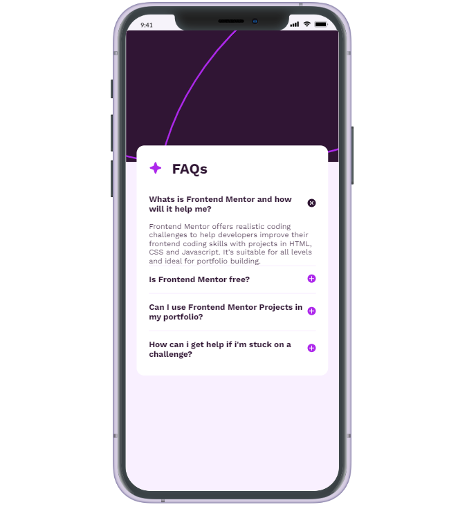
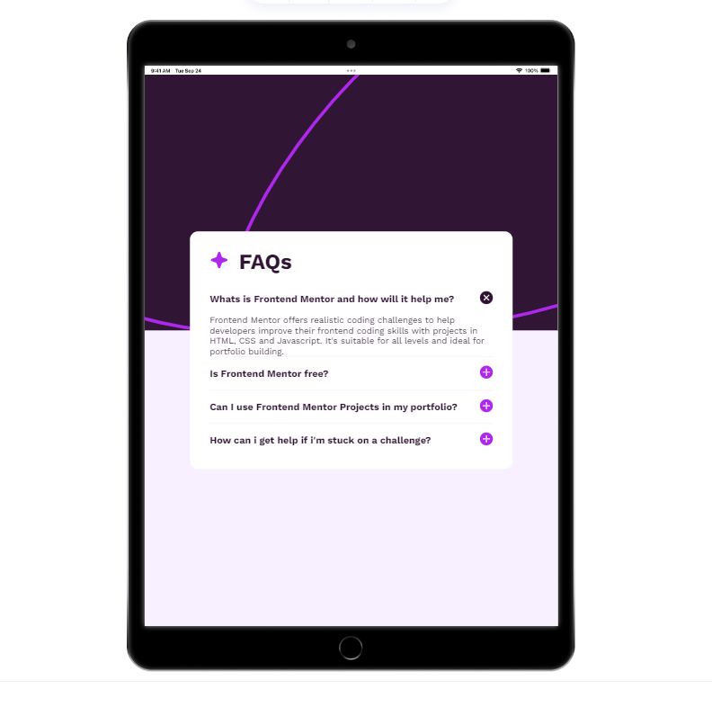
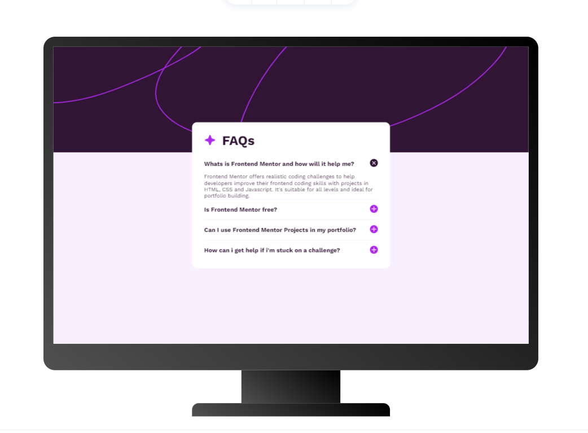

# Frontend Mentor - FAQ accordion solution

This is a solution to the [FAQ accordion challenge on Frontend Mentor](https://www.frontendmentor.io/challenges/faq-accordion-wyfFdeBwBz). Frontend Mentor challenges help you improve your coding skills by building realistic projects. 

## Table of contents

- [Overview](#overview)
  - [The challenge](#the-challenge)
  - [Screenshot](#screenshot)
  - [Links](#links)
- [My process](#my-process)
  - [Built with](#built-with)
  - [Continued development](#continued-development)
  - [Useful resources](#useful-resources)
- [Author](#author)

## Overview

### The challenge

Users should be able to:

- Hide/Show the answer to a question when the question is clicked
- Navigate the questions and hide/show answers using keyboard navigation alone
- View the optimal layout for the interface depending on their device's screen size
- See hover and focus states for all interactive elements on the page

### Screenshot

### Links

- [Solution URL](https://www.frontendmentor.io/solutions/vite-vanilla-javascript-9w2zwXIcaO)
- [Live Site URL](https://faqs-accordion-fm.vercel.app/)

## My process

### Built with
- Vite
- Vanilla Javascript
- SCSS
- Responsive design

### Continued development

I will build more frontend mentor project and improve in all areas i have found difficulties in this project..

### Useful resources

- [Gemini Ai](https://gemini.google.com/) - This helped me when i got stuck in the keyboard navigation logic on javascript.

## Author
- Frontend Mentor - [@markorrente01](https://www.frontendmentor.io/profile/markorrente01)
- X(formerly known as twitter) - [@markorrente01](https://www.twitter.com/markorrente01)